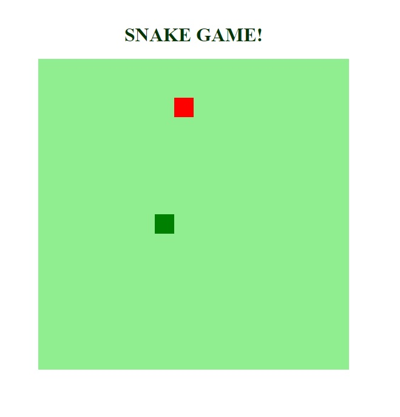

<h2 align="center">Recriando o jogo da cobrinha com JavaScript</h2>

  

---

<h3 align="center">
    <a href="#information_source-sobre">Sobre</a>&nbsp;|&nbsp;
  <a href="#interrobang-motivo">Motivo</a>&nbsp;|&nbsp;
  <a href="#seedling-requisitos-mínimos">Requisitos</a>&nbsp;|&nbsp;
  <a href="#rocket-tecnologias-utilizadas">Material de Referência e Tecnologias Utlizadas</a>&nbsp;|&nbsp;
  <a href="#licença">Licença</a>
</h3>

---

  

## :information_source: Sobre

Apreendendo a recriar o jogo da cobrinha utilizando HTML, CSS e Javascript na prática.

Este projeto foi desenvolvido com a professora  [Gabriela Pinheiro](https://github.com/SpruceGabriela), na plataforma [Digital Innovation One](https://web.dio.me/).

Os conceitos de `HTML`, `CSS`, e principalmente `JavaScript` foram trabalhados nas aulas para a recriação do famoso jogo da cobrinha(Snake Game).

## :interrobang: Motivo

O projeto faz parte do Bootcamp HTML Web Developer da Digital Innovation One.

Aprenda a programar páginas de internet e desenvolver websites utilizando HTML, CSS e JavaScript para iniciar sua trajetória profissional em desenvolvimento web front-end.

## :seedling: Requisitos Mínimos

Navegador web, documentação e editor de código.

# :rocket: Material de Referência e Tecnologias Utilizadas

O projeto foi desenvolvido utilizando as seguintes tecnologias

- [HTML básico](https://www.w3schools.com/html/)
- [CSS básico](https://developer.mozilla.org/pt-BR/docs/Web/CSS)
- [Javascript](https://developer.mozilla.org/pt-BR/docs/Web/JavaScript)

## Licença

Esse projeto está sob a licença MIT. Veja o arquivo [LICENSE](LICENSE) para mais detalhes.

## 🚀 Let's code! 🚀
