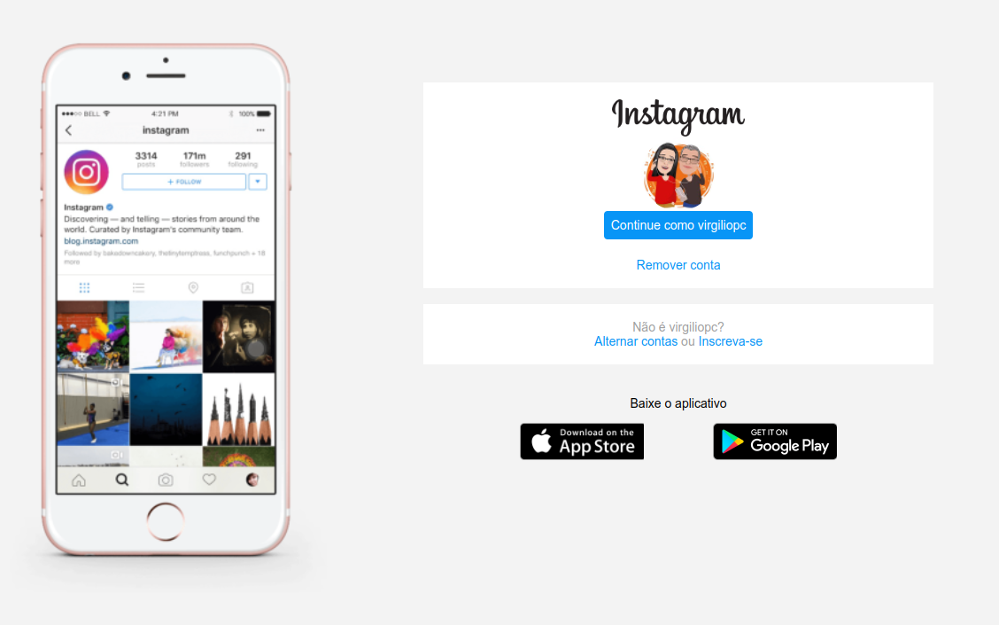

<h2 align="center">#Desafio DIO Instagram</h2>___

<

  

___

<h3 align="center">
  <a href="#information_source-sobre">Sobre</a>&nbsp;|&nbsp;
  <a href="#interrobang-motivo">Motivo</a>&nbsp;|&nbsp;
  <a href="#seedling-requisitos-mínimos">Requisitos</a>&nbsp;|&nbsp;
  <a href="#rocket-tecnologias-utilizadas">Tecnologias</a>&nbsp;|&nbsp;
  <a href="#licença">Licença</a>
</h3>

___

  

## :information_source: Sobre

Recriando a página inicial do Instagram com links e logo da #DIO.

Nesse projeto, foi abordado o conceito sobre CSS Flexbox e responsividade.

Na qual fizemos a interface de login do Instagram! 

## :interrobang: Motivo

O projeto faz parte do Bootcamp HTML Web Developer da Digital Innovation One.

Aprenda a programar páginas de internet e desenvolver websites utilizando HTML, CSS e JavaScript para iniciar sua trajetória profissional em desenvolvimento web front-end.

## seedling: Requisitos Mínimos

Navegador web e editor de código.

# :rocket: Material de referência e Tecnologias Utilizadas

O projeto foi desenvolvido utilizando as seguintes tecnologias

* [HTML básico](https://www.w3schools.com/html/)
* [CSS básico](https://developer.mozilla.org/pt-BR/docs/Web/CSS)

## Licença 

Esse projeto está sob a licença MIT. Veja o arquivo [LICENSE](LICENSE) para mais detalhes.

## 🚀 Let's code! 🚀
